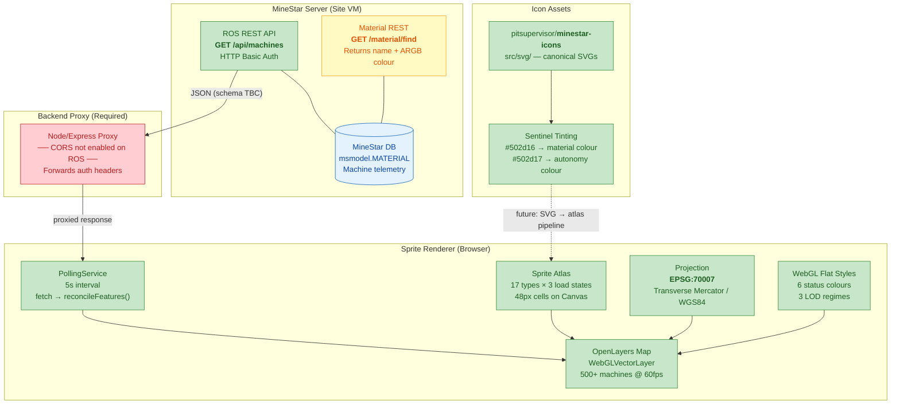
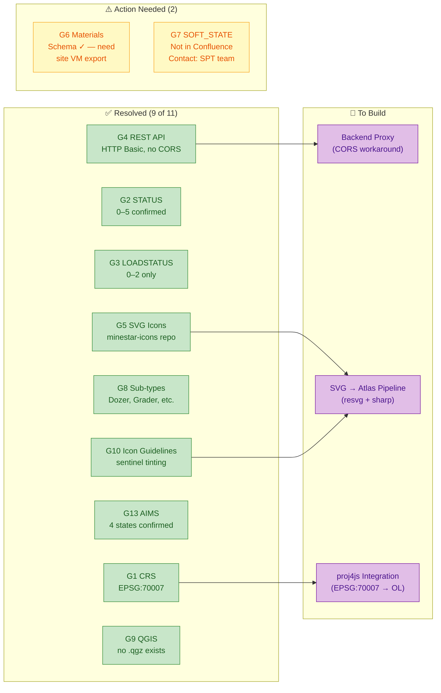

# MineStar Sprite Rendering — Integration Architecture

> Generated 24 Feb 2026. Use a Mermaid renderer (VS Code preview, GitHub, Mermaid Live Editor) to view.

## Diagram 1 — End-to-End Data Flow

**Colour key:** 🟢 Green = confirmed/resolved | 🟡 Yellow = schema known, need site data | 🔴 Red = must be built

---

## Diagram 2 — Gap Status & Build Dependencies

**Arrows** show which resolved gaps feed into the three build items for Phase 2.
